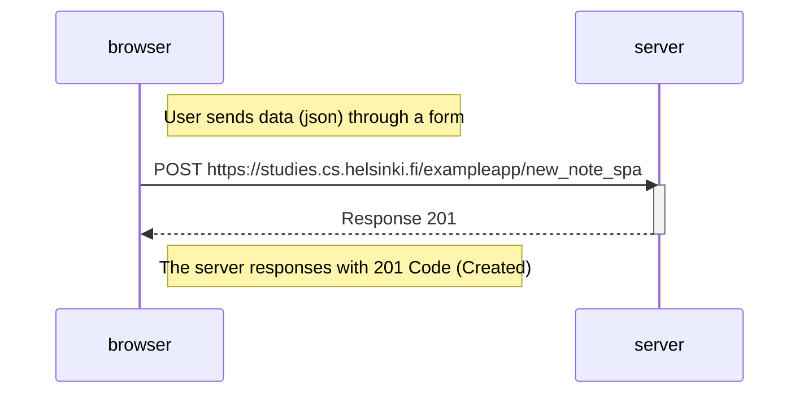

```mermaid
sequenceDiagram
    participant browser
    participant server

    Note right of browser: User sends data (json) through a form

    browser->>server: POST https://studies.cs.helsinki.fi/exampleapp/new_note_spa
    activate server
    server-->>browser: Response 201
    deactivate server

    Note right of browser: The server responses with 201 Code (Created)
  
```